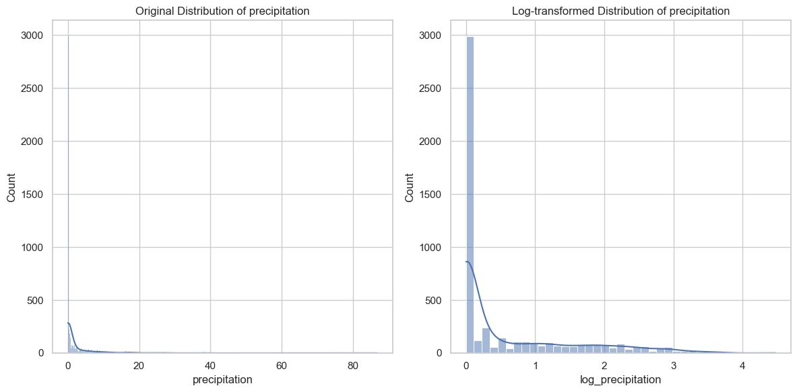
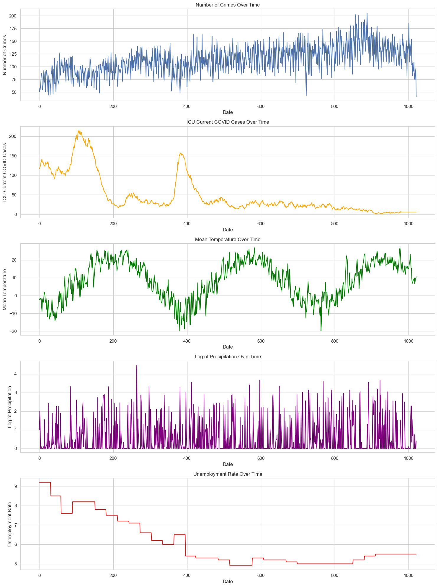
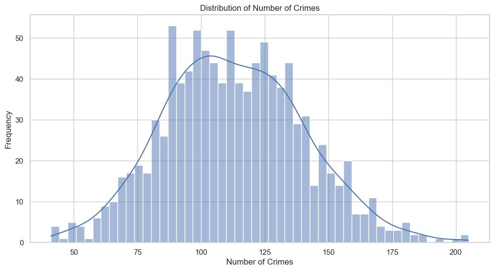
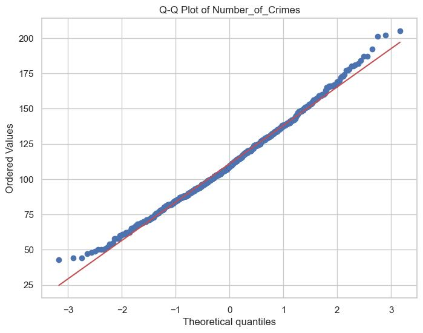

# YorkRegion-CrimeForecast

## Task 1: 30-Day Crime Forecasting

### Objective

The primary aim is to predict the average number of crimes that will occur in York Region over the next 30 days. We utilize a diverse set of features for this purpose:

1. **Historical Crime Data**: Consisting of the number of crimes reported in the preceding 30 days.
  
2. **External Features**: These include metrics like temperature, precipitation levels, and unemployment rates gathered from the last 30 days.
  
3. **Time Features**: These capture the seasonality and trends in the data.

We intend to develop a predictive model that offers accurate estimates of the average number of crimes for the upcoming month.

### Data Preprocessing

The data sources employed include information on crimes in York Region from 2021 to August 2023, as well as:

1. **Unemployment Rate**: Using Ontario’s monthly unemployment rate data, we resample it to a daily frequency for compatibility.
  
2. **Weather Data**: Features like mean temperature (°C), total precipitation (mm), and snow on the ground.
  
3. **ICU Data**: The number of COVID-related ICU patients in York Region.
  
4. **Holidays**: A list of public holidays in Ontario.

#### Feature Engineering

In order to improve model performance, we undertake several feature engineering steps:

1. **Weighted Moving Averages**: New features are created through weighted averages of existing metrics like number of crimes, temperature, and more. These averages are computed over a 30-day span using different weight schemes.
  
2. **Skewness Correction**: Given that some machine learning models are sensitive to feature skewness, we correct for it.

3. **Feature Standardization**: MinMax scaling is applied to normalize the features.

### Data Visualization

We plot some visualizations of the daily crime numbers along with selected features. Additionally, a correlation matrix is rendered to showcase relationships between features and the target variable.

 

 

 
