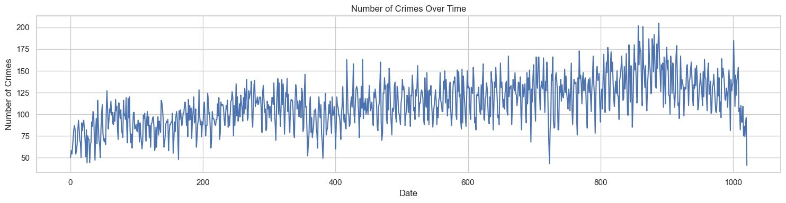
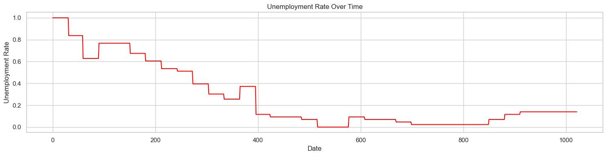
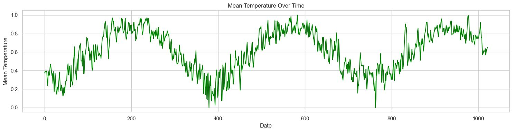
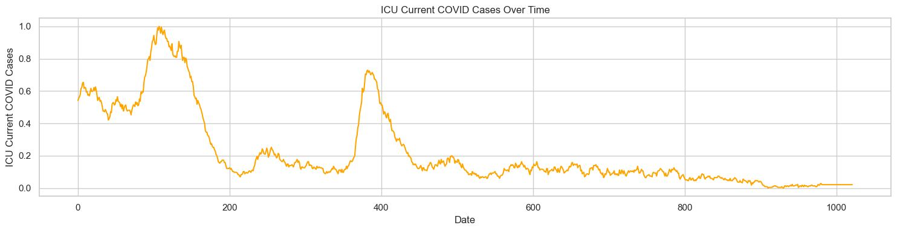
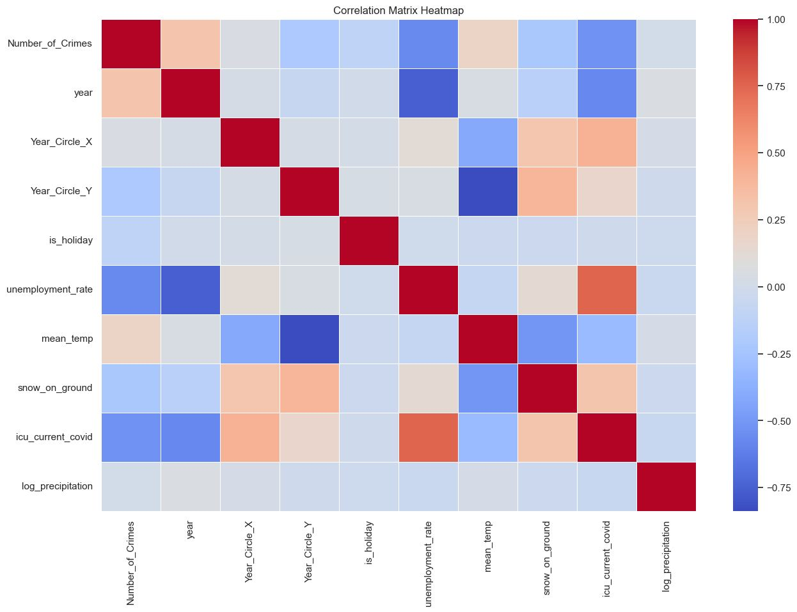
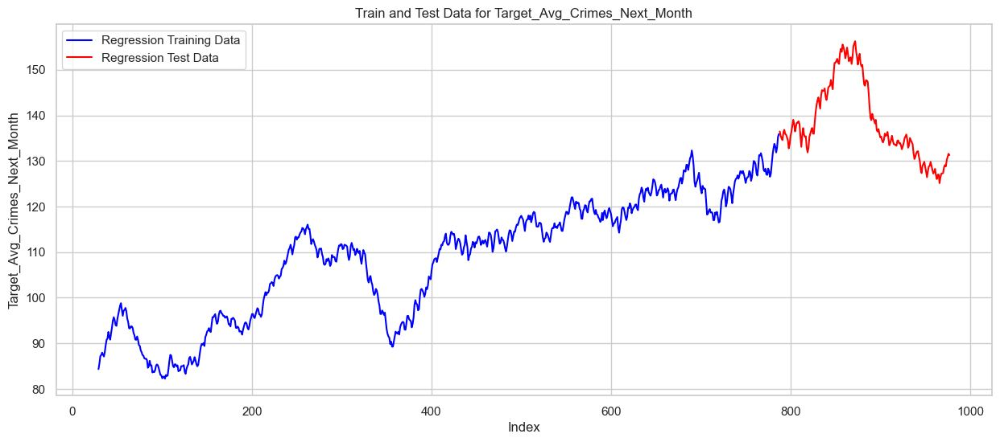
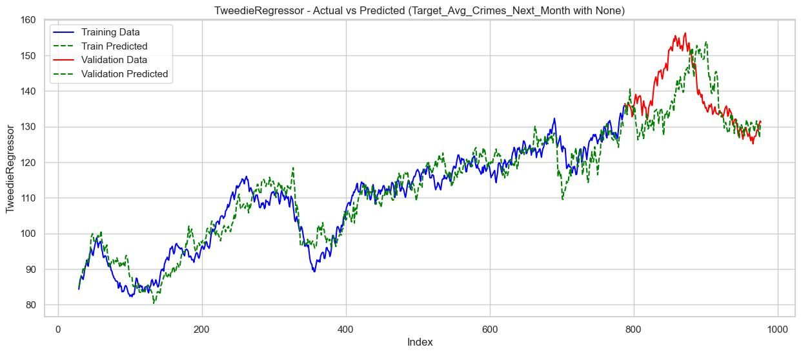
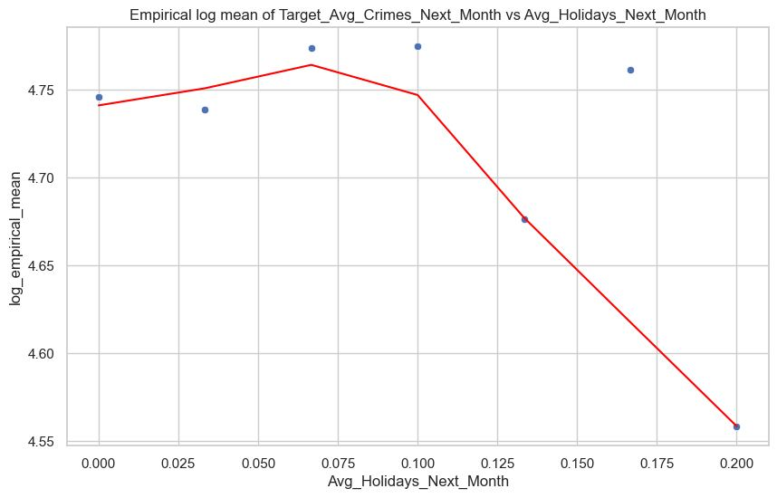
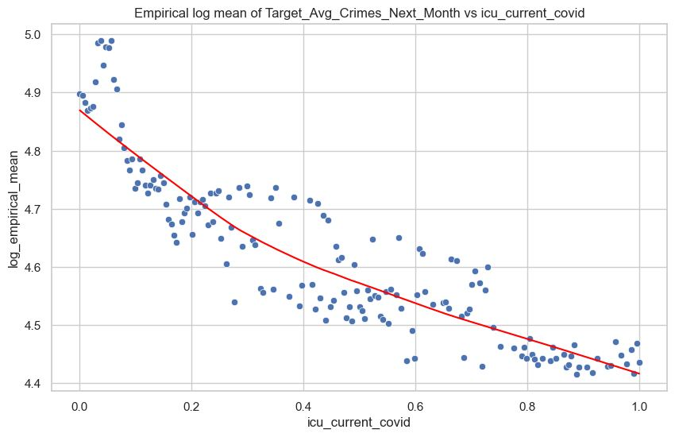

# YorkRegion-CrimeForecast

## Task 1: 30-Day Crime Forecasting

### Objective

The primary aim is to predict the average number of crimes that will occur in York Region over the next 30 days. We utilize a diverse set of features for this purpose:

1. **Historical Crime Data**: Consisting of the number of crimes reported in the preceding 30 days.
  
2. **External Features**: These include metrics like temperature, precipitation levels, and unemployment rates gathered from the last 30 days.
  
3. **Time Features**: These capture the seasonality and trends in the data.

We intend to develop a predictive model that offers accurate estimates of the average number of crimes for the upcoming month.

### Data Preprocessing

The data sources employed include information on crimes in York Region from 2021 to August 2023, as well as:

1. **Unemployment Rate**: Using Ontario’s monthly unemployment rate data, we resample it to a daily frequency for compatibility.
   

  
2. **Weather Data**: Features like mean temperature (°C), total precipitation (mm), and snow on the ground.

  
3. **ICU Data**: The number of COVID-related ICU patients in York Region.

  
4. **Holidays**: A list of public holidays in Ontario.

The target variable appears to be quite volatile, showing significant fluctuations. This is particularly interesting when compared to another inherently unstable data like the "Number of People in ICU."

Additionally, it's worth noting a sudden decline in the dataset's last few days. This drop is likely due to a lag in data updating, rather than an actual decrease in incidents. To mitigate this issue, we will exclude the last 14 days from the training and validation processes to ensure the model's accuracy and reliability.

#### Feature Engineering

In order to improve model performance, we undertake several feature engineering steps:

1. **Weighted Moving Averages**: New features are created through weighted averages of existing metrics like number of crimes, temperature, and more. These averages are computed over a 30-day span using different weight schemes.
  
2. **Skewness Correction**: Given that some machine learning models are sensitive to feature skewness, we correct for it.

3. **Feature Standardization**: MinMax scaling is applied to normalize the features.

### Data Visualization

We plot target objective function with is 30-day average of number of crimes per day in York Region, distribution of number of crimes and its Q-Q plot compared to normal distribution. Additionally, a correlation matrix is rendered to showcase relationships between features and the target variable.

 

 

 

 

### Training and Validation

We trained various models including Linear models, Ridge, Lasso, Generalized Linear Models (GLM), Random Forest, and Boosting Algorithms. As expected, the Poisson Regressor yielded the best results, given its suitability for predicting event rates over time

  

Then we perform an Analysis of Significant Variables for the Poisson Model, focusing on the most important features based on their p-values. According to the assumptions of Poisson regression, the relationship between the log-transformed target variable (Target_Avg_Crimes_Next_Month) and these significant features should be linear. To assess this, we compute the empirical mean of the target variable for each feature and apply a log transformation to linearize these relationships. Scatter plots are generated and Lowess smoothing is applied to identify any underlying trends.

 

 

As observed, some relationships are not linear. To address this, we introduce squared terms for certain variables to linearize the relationship between the log-transformed empirical mean of the target variable (Target_Avg_Crimes_Next_Month) and these features.

We get the final model after applying these modification and retraining it.

